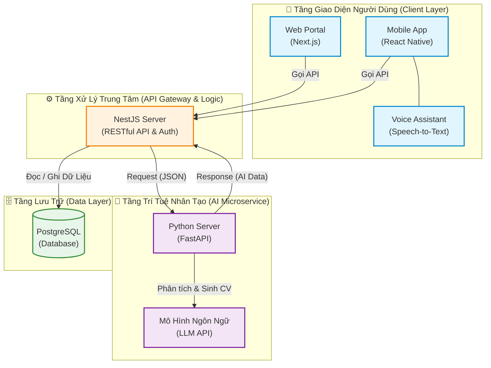

# 🌟 Hệ Thống Hỗ Trợ Tìm Kiếm Việc Làm Cho Người Khuyết Tật (AI-Powered)

Một nền tảng toàn diện (Web & Mobile) ứng dụng Trí tuệ nhân tạo (AI) nhằm xóa bỏ rào cản tìm việc cho người khuyết tật, đồng thời giúp doanh nghiệp tiếp cận nguồn nhân lực đặc thù một cách hiệu quả.

## 🚀 Kiến trúc hệ thống (Tech Stack)

Hệ thống được thiết kế theo kiến trúc Microservices và phát triển đa nền tảng, đảm bảo mọi đối tượng người dùng có trải nghiệm đồng bộ trên mọi thiết bị.

- **Frontend (Web Portal):** Next.js (React) - Tối ưu hóa SEO, phục vụ Admin, Nhà tuyển dụng và Ứng viên.
- **Mobile App:** React Native - Ứng dụng di động linh hoạt tích hợp Voice AI.
- **Core Backend:** NestJS (Node.js) - Xử lý nghiệp vụ trung tâm, cung cấp RESTful API, xác thực JWT.
- **AI Microservice:** Python (FastAPI/Flask) - Xử lý mô hình ngôn ngữ lớn (LLM).
- **Database:** PostgreSQL.
- **DevOps:** Docker, Docker Compose, GitHub Actions (CI/CD), VPS Ubuntu.

## ✨ Tính năng cốt lõi

1. **Đa nền tảng (Cross-platform):** Toàn bộ tính năng tuyển dụng và tìm việc được đồng bộ thời gian thực giữa Web và Mobile.
2. **AI CV Generator:** Tự động tạo và tối ưu hóa CV cho người khuyết tật dựa trên dữ liệu đầu vào.
3. **AI Recommendation:** Gợi ý việc làm sát với năng lực ứng viên và yêu cầu của nhà tuyển dụng.
4. **Voice Assistant (Mobile):** Trợ lý ảo nhận diện và tương tác bằng giọng nói, hỗ trợ tối đa cho người khiếm thị.

## 📂 Cấu trúc Repository (Monorepo Architecture)

Dự án được chia thành các dịch vụ độc lập:
job-matching-system/
├── backend-core/ # NestJS RESTful API & PostgreSQL
├── ai-service/ # Python Microservice
├── web-portal/ # Next.js Frontend
├── mobile-app/ # React Native App
└── docker-compose.yml # Local Environment Setup

## 🛠️ Hướng dẫn khởi chạy môi trường Local (Local Development)

Yêu cầu hệ thống: Có cài đặt Docker Desktop.

Bước 1: Clone dự án về máy

git clone [https://github.com/PL21zzz/job-matching-system.git](https://github.com/PL21zzz/job-matching-system.git)
cd job-matching-system

Bước 2: Khởi chạy Cơ sở dữ liệu bằng Docker

docker-compose up -d

## 🗺️ Sơ Đồ Kiến Trúc Hệ Thống (System Architecture)

Hệ thống được thiết kế theo luồng Microservices, tách biệt hoàn toàn giữa Core Logic và AI Processing để đảm bảo hiệu năng tối đa.

